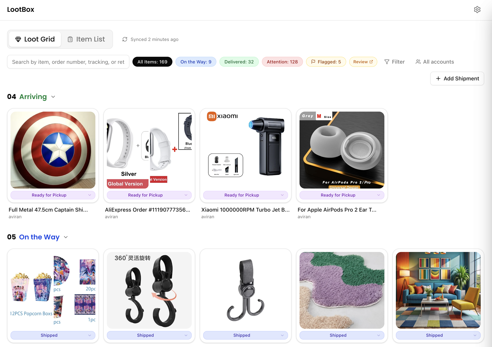

# LootBox

> **Work in progress** — actively being developed. Features may change, break, or disappear.

**Your shipments, unboxed.** A self-hosted shipping dashboard that scans your Gmail, extracts tracking info, and gives you one clean view of everything headed your way.

No more digging through emails. No more "did I already order that?" Just open LootBox and see what's coming.

<p align="center">
  
</p>

---

## What it does

- **Gmail sync** — Connects via OAuth2 and automatically finds shipping/order confirmation emails
- **Smart parsing** — Extracts carriers, tracking numbers, product names, and images from 10+ carrier formats (FedEx, UPS, USPS, DHL, Amazon, AliExpress, and more)
- **Live dashboard** — See all your shipments at a glance with status, carrier, ETA, and product images
- **Detail view** — Tap any shipment for the full timeline: order date, tracking events, original email
- **Flag & review** — Flag suspicious or interesting shipments with multi-select reasons and notes
- **Research export** — Export flagged items for further investigation
- **Password protected** — Simple family-friendly password gate keeps it private
- **Dark mode** — Because obviously

## Stack

| Layer | Tech |
|-------|------|
| Framework | Next.js 16 + React 19 |
| Styling | Tailwind v4 + shadcn/ui |
| Database | SQLite (libsql + Drizzle ORM) |
| Email | Gmail API (OAuth2) |
| Fonts | Geist Sans, Geist Mono, Poppins |
| Hosting | Railway (persistent volume) |

## Quick start

```bash
# Clone it
git clone https://github.com/aviranrevach/shipping-tracker.git
cd shipping-tracker

# Install
npm install

# Set up env vars (see .env.production.example)
cp .env.production.example .env.local
# Fill in your Google OAuth2 credentials + SITE_PASSWORD

# Run
npm run dev
```

Open [localhost:3000](http://localhost:3000) and connect your Gmail account from settings.

## Environment variables

| Variable | Description |
|----------|-------------|
| `GOOGLE_CLIENT_ID` | OAuth2 client ID from Google Cloud Console |
| `GOOGLE_CLIENT_SECRET` | OAuth2 client secret |
| `GOOGLE_REDIRECT_URI` | OAuth callback URL (`http://localhost:3000/api/auth/callback` for dev) |
| `DATABASE_PATH` | SQLite file path (default: `./data/lootbox.db`) |
| `SITE_PASSWORD` | Password to access the app |

## Project structure

```
src/
  app/              # Next.js app router pages + API routes
  components/       # UI components (dashboard, shipment detail, settings)
  lib/
    db/             # Drizzle schema + database client
    gmail/          # Gmail API integration + OAuth
    parsers/        # Email parser chain (10+ carrier formats)
    sync/           # Sync engine — orchestrates Gmail fetch + parse + store
data/               # SQLite database + cached images (gitignored)
```

## Deploy

LootBox runs great on **Railway** with a persistent volume mounted at `/app/data` for the SQLite database and cached product images. Set your env vars in the Railway dashboard and you're live.

---

Built by [@aviranrevach](https://github.com/aviranrevach)
